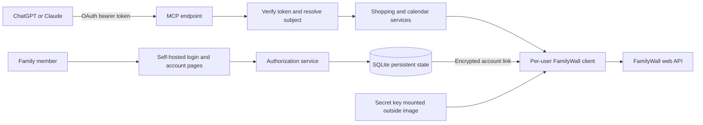

# Proposed architecture

Status: design, not implemented. Recorded 2026-09-13. Product decisions: Python;
a few invited family members; separate logins; entirely self-hosted authentication;
shopping lists and a reliable weekly calendar first. See [implementation plan](implementation-plan.md).

## User experience

1. The operator creates an invitation for a named user. The user opens the short-lived,
   single-use invitation on this server and sets their MCP username/password.
2. In the server's account page, the user enters their FamilyWall username/password.
   The server validates the login and discovers accessible families. The user selects
   a default family, shopping list, timezone, and week start.
3. The user adds `https://<their-domain>/mcp` to ChatGPT or Claude, follows the
   browser OAuth login, and grants the displayed permissions.
4. The AI receives tool results; passwords and FamilyWall cookies never enter tool
   arguments or results. The server resolves each OAuth subject to that user's link.
5. A changed FamilyWall password leads to a clear reconnect instruction linking to
   the fixed account page. Updating it invalidates that user's cached session.

The MCP username may equal the FamilyWall username, but they are separate accounts.
A username alone is not authentication. OAuth client IDs identify applications,
not people. Never key a FamilyWall session by `client_id`, a model-supplied username,
an email string, or an MCP transport session ID.

## System boundaries



One Python application, one worker, one SQLite volume and a TLS reverse proxy are
enough initially. Authorization and resource-server responsibilities remain separate
modules, even when served in one process. No queue, Redis, Kubernetes, external login
service, frontend SPA, LLM API dependency, or TypeScript subprocess is required.

## Technology decisions

| Area | Proposed choice | Reason / qualification |
| --- | --- | --- |
| Runtime | Python 3.12+, `uv`, `pyproject.toml`, committed lockfile | Matches existing Python preference; reproducible agent work |
| MCP | Official Python `mcp` SDK; evaluate and pin current stable v2 in P0 | Current documentation uses `MCPServer`; Halaxy uses older v1 `FastMCP` imports |
| HTTP | `httpx.AsyncClient`, bounded timeouts, per-user cookie jars | Direct Python port of wire behavior; no Node service to deploy |
| Domain schemas | Pydantic models; explicit upstream-to-domain adapters | Tolerate harmless upstream additions without accepting malformed required fields |
| Web | Starlette/ASGI with server-rendered, escaped forms | Small account/login surface; no browser credentials in JavaScript storage |
| Auth | Self-hosted OAuth authorization code + PKCE, persistent provider | User choice; reuse SDK protocol support where verified, implement account storage separately |
| State | SQLite with migrations, foreign keys, WAL and transactions | Small invited group; reject unsupported multi-worker operation initially |
| Secrets | `cryptography` AES-GCM encryption, Argon2id login password hashes | Recoverable FamilyWall password; non-recoverable MCP login password |
| Tests | pytest, async tests, HTTPX mock transport; Ruff and mypy | Contract and failure-path coverage without live credentials |
| Hosting | Non-root Docker container, Caddy TLS, persistent `/data` | Familiar Halaxy deployment; amd64/arm64 build targets |

These are design choices, not dependency installation claims. P0 must verify exact
SDK imports and provider APIs against an installable release before P1 locks them.
The [official Python SDK](https://py.sdk.modelcontextprotocol.io/) documents v2;
its [authorization guide](https://py.sdk.modelcontextprotocol.io/run/authorization/)
recommends resource-server verification with a separate authorization server and
retains an embedded provider option. Using the embedded option for this small,
self-hosted service is a deliberate tradeoff: isolate it behind `auth/`, test it
over HTTP, and do not assume its example login or storage code is production ready.
If the chosen release cannot satisfy the contract below, P0 must select a maintained
self-hosted authorization component and revise the ADR before dependent work.

## Proposed package layout

```text
src/familywall_mcp/
  config.py              # validated settings, explicit local/hosted mode
  cli.py                 # serve, invite, disable user, recovery, key rotation
  app.py                 # lifespan and ASGI wiring
  auth/                  # provider, login, consent, token verifier, principal
  accounts/              # invitation/account pages, FamilyWall linking, defaults
  storage/               # repositories, migrations, secret encryption
  familywall/            # client, wire models, parsers, sessions, API errors
  services/              # ownership checks, list selection, calendar ranges
  tools/                 # MCP input/output schemas and thin tool handlers
tests/
  unit/                  # synthetic wire fixtures and domain behavior
  integration/           # local fake upstream and actual MCP HTTP/auth
  live/                  # opt-in test-family probes, excluded from default runs
docs/                    # plan, contracts, decisions, operational runbooks
```

## Identity and storage contract

| Record | Minimum fields and invariants |
| --- | --- |
| User | Immutable random ID, unique normalized MCP username, password hash, active/disabled, session generation, timestamps |
| Invitation/recovery | Hash of random token, intended account, expiry, consumed timestamp; single-use transaction; no public registration |
| FamilyWall link | User ID FK, encrypted username/password, key version, credential generation, connection state; ciphertext bound to user ID and field with AEAD associated data |
| Preferences | User ID, default family/list IDs, IANA timezone, week start; validate membership when selected and when used |
| OAuth client | Validated client metadata and exact allowed redirect URIs; client identity separate from user identity |
| Authorization grant | Hashed one-use code, subject, client, redirect, resource, scopes, PKCE challenge, expiry; atomic consumption |
| Tokens | Hashed opaque access/refresh tokens, subject, client, audience/resource, scopes, expiry, revocation and rotation-family identifiers |
| Web session | Hashed opaque cookie ID, user, expiry, CSRF state; passwords/tokens never in client cookies |
| Operation receipt | Subject, family/list, caller operation ID, payload hash, pending/succeeded/unknown result, upstream ID, expiry |

Store only what the service needs. Keep FamilyWall cookies in memory initially;
restart performs a fresh login when required. Use a per-user client pool with bounded
idle eviction and one login lock per credential generation. Never share a global
cookie jar. Revoking a link closes its clients and deletes its secret; disabling a
user also revokes OAuth grants and web sessions. Check user status on every call,
so a token cannot retain access until natural expiry after local disablement.

The deployment key is required at hosted startup and mounted as a secret outside
the image and database. Never generate a replacement automatically on restart.
Keep versioned old keys during a transactional rotation; test rollback and backups.
An encrypted DB without its separately backed-up key is unrecoverable. Do not store
raw request/response bodies, family names, event titles or passwords in logs; use
operation IDs, endpoint labels, status and duration.

The data directory is owner-only (`0700`), with credential-bearing files `0600`.
Bootstrap the first account with a local operator command; there is no default
administrator password. An invitation proves possession of its bearer link, not
an independently verified email identity. Bind it to the operator's intended account
record; the operator shares it privately. Recovery uses a new operator-issued,
single-use link and revokes existing sessions/grants. Password change rotates web
session IDs and revokes existing OAuth grants. Account deletion removes its credentials,
preferences and sessions; short-lived sanitized receipt tombstones prevent accidental
replay during the documented retention window.

## OAuth and account-page contract

Serve discovery plus authorization, token, revocation, login and consent routes.
Use canonical resource `https://<domain>/mcp`, consistent issuer metadata, and
authorization code + S256 PKCE. Return 401 with a protected-resource metadata pointer
for missing/expired MCP tokens; enforce per-tool scopes after verifying tokens.
FamilyWall login expiry is a separate domain error, not an MCP 401 that sends users
through an unrelated OAuth login loop.

Prefer known-client CIMD support when the selected library supports it correctly;
pre-registered ChatGPT and Claude clients with exact callback URIs are the first
fallback. Keep DCR disabled unless an actual supported client needs it. The
[current MCP authorization spec](https://modelcontextprotocol.io/specification/2026-07-28/basic/authorization)
prefers CIMD and retains DCR for compatibility. Never advertise unsupported metadata.
Restrict metadata fetches to configured trusted client document URLs; prevent redirects
or DNS resolution into private networks. Do not implement a general URL fetch tool.

OAuth acceptance includes code expiry/replay, wrong verifier, client/redirect/resource
substitution, scope escalation, refresh rotation/reuse, revocation, expired web state,
CSRF, XSS, brute-force limits, account enumeration and restart persistence. Persist
refresh rotation atomically; a reused refresh token revokes its family. Choose and
document lifetimes initially: 5-minute authorization codes, 1-hour access tokens,
30-day refresh lifetime, 30-minute account sessions, and 24-hour invitations.
These are proposed product defaults, not upstream guarantees.

Login/consent forms must identify the client, requested capabilities and account.
Use server-generated internal flow state distinct from OAuth client `state`, secure
HttpOnly SameSite cookies, CSRF protection, escaped templates, a restrictive CSP,
no third-party scripts and no password-bearing query strings. Invitation/recovery
tokens are short-lived bootstrap secrets; redact their URLs from access logs and
consume then redirect to a clean URL. Limit login attempts per account and source
IP; trust forwarded IP headers only from the configured proxy.

All HTTP MCP tools require login, including reads. Suggested scopes are
`familywall:read` and `familywall:lists:write`; calendar writes receive a separate
scope when added. Tool annotations describe behavior; they do not enforce access.
Local stdio has an explicit single-user process principal from local configuration;
the hosted path must never fall back to that identity.

The current [ChatGPT authentication documentation](https://developers.openai.com/plugins/build/auth)
requires discoverable metadata, PKCE, resource binding and a supported OAuth client
registration method. Copy the callback shown by the actual client instead of copying
Halaxy's hostname allowlist. [Claude's authentication documentation](https://claude.com/docs/connectors/building/authentication)
also distinguishes per-user OAuth from shared static-header credentials. Test both
actual accounts: supporting a protocol on paper is not a connection test.

## FamilyWall service rules

- Family IDs are resource selectors, never permission grants. Verify that each family
  belongs to the current linked account. Check list/event membership inside that
  family; a valid-looking ID from another user must not trigger an upstream write.
- Select the saved default family/list when valid. If there is one eligible choice,
  return/use it; if several remain, return an ambiguity error with safe choices.
  Never select the first list merely because it is first in an API response.
- Parse upstream errors even when HTTP status is 200. A login page, forbidden response,
  malformed payload or timeout must never become an empty calendar or list.
- Retry bounded reads only, with backoff and jitter where appropriate. Reauthenticate
  at most once per read after confirmed session expiry. No blind automatic retry of
  mutation requests after an ambiguous timeout or reconnect.
- Do not promise exactly-once remote writes. Persist a mutation receipt before sending;
  same operation ID and payload returns its known outcome, mismatched payload errors.
  A crash/timeout after send becomes `outcome_unknown` and triggers a read/reconciliation
  step. A title match alone cannot prove which request created an item.
- Require a caller-supplied opaque `operation_id` for mutations. Unique key:
  `(subject, family_id, list_id, operation_id)`; hash a canonical payload including
  tool name. Retain receipts for a documented 30-day initial window, do not auto-resend
  an in-flight/unknown receipt, and return the same stored successful result on replay.
  After expiry there is no deduplication guarantee; tool descriptions must say so.
  Different operation IDs are distinct intentions even if their titles match.
- List item completion uses an explicit target state, never a toggle. Adding “bread”
  is append semantics; if the user wants another quantity or an existing-item update,
  the model must resolve the existing item through a separate supported operation.
- Preserve all-day dates, time zones, recurrence identity, exclusions and cancellations.
  “This week” uses the saved week start, defaulting to Monday 00:00 to the next Monday
  in the user's IANA timezone;
  return the resolved interval and timezone. Use half-open ranges and DST-aware bounds.
- Upstream event/list text is untrusted data. Do not concatenate it into server
  instructions or use it as permission to access URLs, other accounts or extra tools.

## Initial tool contract

Every result uses a typed schema with data plus useful context, not raw upstream JSON.
Errors use MCP `isError` and a stable domain code with a safe recovery suggestion.
Implement structured output using the pinned SDK; do not hand-roll JSON-RPC.

| Tool | Input essentials | Result / behavior |
| --- | --- | --- |
| `get_connection_status` | none | Linked/disconnected state, timezone and safe defaults; no credentials |
| `list_families` | none | Accessible family IDs and display names |
| `list_lists` | optional family ID/type | IDs, names, types; explicit completeness/cursor |
| `get_list` | list ID, optional family ID/cursor/limit | Normalized items with IDs and checked state |
| `add_list_item` | title, optional family/list IDs, operation ID | Created item ID and list; unknown outcome explicitly represented |
| `set_list_item_checked` | list/item IDs, boolean checked, operation ID | Confirmed target state, no toggle |
| `get_calendar_events` | explicit start/end, optional family ID/timezone | Sorted overlapping occurrences; range, timezone, completeness and warnings |
| `get_week_overview` | optional date within week/family/timezone | Calendar-only week overview using the same range service |

For `set_list_item_checked`, `list_id` supports local membership validation and
readback. The known `taskmark` request sends only `a00taskId` and `a00complete`
(plus common fields); do not add an invented upstream list selector. If the item
cannot be verified as belonging to the authorized list, refuse the mutation.
Cursor/limit fields in this proposed tool surface are enabled only after a real
upstream continuation contract or explicitly bounded local snapshot scheme exists.
Do not advertise an input the adapter cannot honor.

For every FamilyWall tool `openWorldHint=true`. Reads use `readOnlyHint=true`;
writes use `readOnlyHint=false`. Add is not globally idempotent merely because it
accepts a receipt ID, so mark it conservatively. Set-checked can be idempotent after
wire semantics are verified; destructive operations added later need accurate hints.
Client confirmation behavior remains the client's decision; a routine authorized
shopping addition does not require a second custom confirmation mechanism.

`get_week_overview` initially covers calendar events, not meals, budgets or undated
tasks. State that scope in its description and output. Expand only when those
FamilyWall endpoints have evidence and their own acceptance tests.
